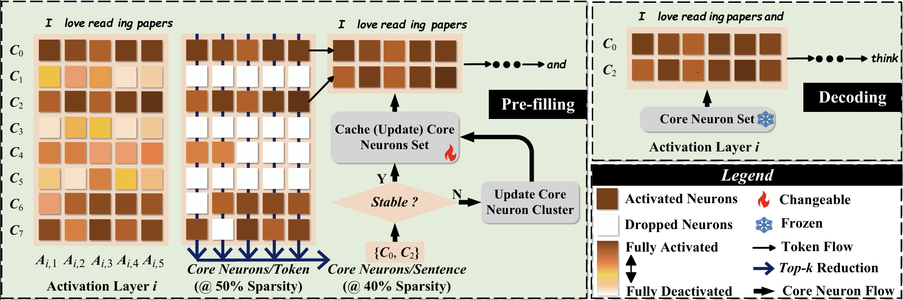

# CoreInfer: Accelerating Large Language Model Inference with Semantics-Inspired Adaptive Sparse Activation

## TL;DR

CoreInfer is an MLP-free adaptive sparse activation inference method based on sentence-level prediction, achieve a **10.33x** speedup compared to the Transformers implementation.

Paper Link:

Project Web:



The overview framework of CoreInfer. In the pre-filling stage, at each activation layer, taking the i-th activation layer as an example, we first extract the token-wise core neurons based on the top-k selection and then further extract the top-k commonly activated core neurons among all tokens, which go through the stability estimation to determine how to update the sentence-wise core neuron set. After determination, the core neuron set will be fixed and utilized for sparse decoding.


The current release supports:

- FP16 inference for opt models and Llama models under any sparisity.
- Performance evaluation of various tasks on lm_eval.
- Hardware performance evaluation on different hardware devices.


## Demo

CoreInfer v.s. Transformers Implement on Question-Answer Task.


https://github.com/user-attachments/assets/17db5ae0-cd9d-4196-a233-45a85f302166


CoreInfer v.s. Transformers Implement on Summarization Task.


https://github.com/user-attachments/assets/009f01c5-01fc-4302-8906-a55274f2e654


CoreInfer v.s. Transformers Implement on a single RNVIDIA TITAN Xp (12G) running opt (ReLU)-7B with amazing speedup! At the same time, CoreInfer performs well in both question-answering and summarization tasks.


## Install

1. Clone the repo and navigate to coreinfer:

```python
git clone https://github.com/wangqinsi1/CoreInfer.git
cd coreinfer
```

2. Set up environment:

```python
conda create -yn coreinfer python=3.10
conda activate coreinfer
pip install -e .
```


## Fast Inference

（Optional）Download Model and Dataset

You can download the required models and datasets to the specified location using the following command.

```python
python download.py --model_name  $model --checkpoint_path /PATH/TO/SAVE/MODEL --data_name $dataset --data_config $data_config  --datasave_path /PATH/TO/SAVE/DATASET

# e.g.: python download.py --model_name  'facebook/opt-6.7b' --checkpoint_path "./models/opt-6.7b" --data_name "truthfulqa/truthful_qa" --data_config "generation" --datasave_path "./dataset/trurthul_qa"

# e.g.: python download.py --model_name  'meta-llama/Llama-3.1-8B' --checkpoint_path "./models/llama3-8b" --data_name "truthfulqa/truthful_qa" --data_config "generation" --datasave_path "./dataset/trurthul_qa" --token "xxxxx"
```

We provide two sparse inference methods: stability-guided and similarity-guided.

#### Stability-guided Inference

- Inference on high-performance device.

When the GPU memory is large enough to hold the original model, you can use the following command to directly run stability-guided inference.

```python
python coreinfer.py --model_name $model --prompt $prompt -num_tokens_to_generate $maximum_output_tokens --task_type $task --checkpoint_path /PATH/TO/MODEL --sparsity $model_sparsity

# e.g.: python coreinfer.py --model_name 'opt-6.7b' --prompt "What is the spiciest part of a chili pepper?" --num_tokens_to_generate 256 --task_type 'QA' --checkpoint_path './models/opt-6.7b' --sparsity 0.4

# e.g.: python coreinfer.py --model_name 'llama3-8b' --prompt "What is the spiciest part of a chili pepper?" --num_tokens_to_generate 256 --task_type 'QA' --checkpoint_path './models/llama3-8b' --sparsity 0.4
```

- Inference on low-performance devices

When the GPU memory is limited and the model cannot be fully loaded, enable memory limit to significantly speed up the model operation. You can adjust the memory required for inference by adjusting sparsity.

```python
python coreinfer.py --model_name $model --prompt $prompt -num_tokens_to_generate $maximum_output_tokens --task_type $task --checkpoint_path /PATH/TO/MODEL --sparsity $model_sparsity --memory_limit

# e.g.: python coreinfer.py --model_name 'opt-6.7b' --prompt "What is the spiciest part of a chili pepper?" --num_tokens_to_generate 256 --task_type 'QA' --checkpoint_path './models/opt-6.7b' --sparsity 0.4 --memory_limit

# e.g.: python coreinfer.py --model_name 'llama3-8b' --prompt "What is the spiciest part of a chili pepper?" --num_tokens_to_generate 256 --task_type 'QA' --checkpoint_path './models/llama3-8b' --sparsity 0.4 --memory_limit
```

Currently we provide three tasks: QA, Summary, and Translate_de_en. If you want to try more tasks, you can implement it by adding the few shot example corresponding to the task in utils.py.

#### Similarity-guided Inference

- Pre-classification of neurons

Similarity-guided Inference requires pre-classification of neurons according to the task. We provide QA pre-classified neurons for Llama3.1-8B and opt6.7B in cluster/. If you want to try other models or other tasks, you can select a dataset suitable for the task and pre-classify neurons using the following command:

```python
python cluster.py --model_name $model --dataset_name $dataset  --checkpoint_path /PATH/TO/MODEL --dataset_path /PATH/TO/DATASET --cluster_path /PATH/TO/SAVE/CLUSTER --sparsity $sparsity

# e.g.: python cluster.py --model_name  'opt-6.7b' --dataset_name 'truthful_qa'  --checkpoint_path './models/opt-6.7b' --dataset_path './dataset/trurthul_qa' --cluster_path './cluster/opt-6.7B_QA' --sparsity 0.4

# e.g.: python cluster.py --model_name  'llama3-8b' --dataset_name 'truthful_qa'  --checkpoint_path './models/llama3-8b' --dataset_path './dataset/trurthul_qa' --cluster_path './cluster/Llama3-8B_QA' --sparsity 0.4
```

The classified neurons will be saved to /PATH/TO/SAVE/CLUSTER.

- Inference on high-performance device.

When the GPU memory is large enough to hold the original model, you can use the following command to directly run similarity-guided inference.

```python
python coreinfer.py --model_name $model --prompt $prompt -num_tokens_to_generate $maximum_output_tokens --task_type $task --checkpoint_path /PATH/TO/MODEL --sparsity $model_sparsity --method 'similarity_guided' --cluster_path /PATH/TO/SAVE/CLUSTER

# e.g.: python coreinfer.py --model_name 'opt-6.7b' --prompt "What is the spiciest part of a chili pepper?" --num_tokens_to_generate 256 --task_type 'QA' --checkpoint_path './models/opt-6.7b' --sparsity 0.4 --method 'similarity_guided' --cluster_path './cluster/opt-6.7B_QA'

# e.g.: python coreinfer.py --model_name 'llama3-8b' --prompt "What is the spiciest part of a chili pepper?" --num_tokens_to_generate 256 --task_type 'QA' --checkpoint_path './models/llama3-8b' --sparsity 0.4 --method 'similarity_guided' --cluster_path './cluster/Llama3-8B_QA'
```

- Inference on low-performance devices

When the GPU memory is limited and the model cannot be fully loaded, enable memory limit to significantly speed up the model inference.

```python
python coreinfer.py --model_name $model --prompt $prompt -num_tokens_to_generate $maximum_output_tokens --task_type $task --checkpoint_path /PATH/TO/MODEL --sparsity $model_sparsity --method 'similarity_guided' --cluster_path /PATH/TO/SAVE/CLUSTER --memory_limit

# e.g.: python coreinfer.py --model_name 'opt-6.7b' --prompt "What is the spiciest part of a chili pepper?" --num_tokens_to_generate 256 --task_type 'QA' --checkpoint_path './models/opt-6.7b' --sparsity 0.4 --method 'similarity_guided' --cluster_path './cluster/opt-6.7B_QA' --memory_limit

# e.g.: python coreinfer.py --model_name 'llama3-8b' --prompt "What is the spiciest part of a chili pepper?" --num_tokens_to_generate 256 --task_type 'QA' --checkpoint_path './models/llama3-8b' --sparsity 0.4 --method 'similarity_guided' --cluster_path './cluster/Llama3-8B_QA' --memory_limit
```

If you want to try a new task, after saving the cluster, add your task name in utils.py to implement inference.


## Task Performance Evaluation

Our task evaluation is based on lm_eval. You can evaluate the performance of the model under  any sparsity by running the following command and providing task_name supported by lm_eval. If method is 'similarity_guided', please provide --cluster_path, otherwise you don't need to provide it. Similarly, you can add --memory_limit to test under low-performance device conditions.

```python
cd evaluate

python evaluate_task.py --model_name $model --task_name $task  --checkpoint_path /PATH/TO/MODEL --method ['stable_guided', 'similarity_guided'] --sparsity $model_sparsity --cluster_path /PATH/TO/SAVE/CLUSTER --memory_limit

# e.g.: python evaluate_task.py --model_name 'opt-6.7b' --task_name 'truthfulqa_gen' --checkpoint_path '../models/opt-6.7b' --method 'stable_guided' --sparsity 0.4

# e.g.: python evaluate_task.py --model_name 'llama3-8b' --task_name 'truthfulqa_gen' --checkpoint_path '../models/llama3-8b' --method 'stable_guided' --sparsity 0.4
```


## Hardware Performance Evaluation

You can run the following command to see the speed. If method is 'similarity_guided', provide --cluster_path, otherwise, do not provide it. Add --memory_limit to test on low-performance devices.

```python
cd evaluate
python evaluate_hardware.py --model_name $model --checkpoint_path /PATH/TO/MODEL  --method ['stable_guided', 'similarity_guided'] --sparsity $model_sparsity --cluster_path /PATH/TO/SAVE/CLUSTER --memory_limit

# e.g.: python evaluate_hardware.py --model_name 'opt-6.7b' --num_tokens_to_generate 512 --checkpoint_path '../models/opt-6.7b' --sparsity 0.4

# e.g.: python evaluate_hardware.py --model_name 'llama3-8b' --num_tokens_to_generate 512 --checkpoint_path '../models/llama3-8b' --sparsity 0.4
```


## Paper and Citation

More technical details can be found in our paper. If you find CoreInfer useful or relevant to your project and research, please kindly cite our paper:


